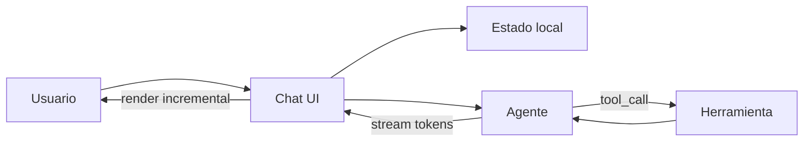

# 🖥️ Módulo 03: Integración Frontend Completa con Agentes IA

Este módulo aterriza cómo se conecta una interfaz conversacional moderna con un agente de IA. Vas a practicar patrones de **estado de chat**, **streaming en frontend**, **tool calls**, **optimistic UI** y **máquinas de estado**. Aunque el producto real suele implementarse con React y Vercel AI SDK, aquí lo simulamos en Python para entender la coreografía completa entre usuario, UI, herramientas y respuesta final.

## 🎯 Objetivos de Aprendizaje

Al completar este módulo, serás capaz de:

- [x] Modelar el estado de una sesión de chat en memoria
- [x] Entender cómo una UI maneja turnos de usuario y asistente
- [x] Simular streaming de respuestas en un contexto frontend
- [x] Implementar un ciclo de tool calls con despacho estructurado
- [x] Aplicar optimistic UI sin perder consistencia de historial
- [x] Diseñar una máquina de estados para idle/thinking/streaming/error
- [x] Pensar en retry, recuperación y trazabilidad de interacciones

## 📂 Estructura del Módulo

```
03_frontend_completo/
├── README.md
├── examples/
│   ├── 01_basico.py
│   ├── 02_intermedio.py
│   └── 03_avanzado.py
├── exercises/
│   ├── 01.md
│   ├── 02.md
│   └── 03.md
└── solutions/
    ├── 01.py
    ├── 02.py
    └── 03.py
```

## 🧠 Concepto Central

Un frontend con agentes IA no solo renderiza texto: coordina mensajes, loaders, estados transitorios, resultados de herramientas y posibles fallos. La UI actúa como un pequeño orquestador del lado cliente.



### Idea práctica

```
user sends message
     │
     ▼
[idle] -> [thinking] -> [tool_call?] -> [streaming] -> [idle]
                       \-> [error] -> [retry]
```

## 🕰️ Historia y Contexto

Las primeras UIs web de chat trataban al backend como una caja negra: enviaban una petición y esperaban una respuesta completa. Eso era suficiente para bots simples, pero quedó corto cuando aparecieron asistentes que:

- generan texto de forma incremental,
- invocan herramientas externas,
- renderizan componentes dinámicos,
- y necesitan conservar historial y contexto.

La evolución fue más o menos así:

1. **AJAX clásico**: una request, una respuesta completa.
2. **SPAs con React**: mejor manejo de estado local y render declarativo.
3. **Streaming de LLMs**: la UI empieza a pintar antes de tener el mensaje final.
4. **AI SDKs modernos**: abstracciones para tool calls, streams y mensajes tipados.
5. **Generative UI**: la respuesta ya no es solo texto; puede ser interfaz accionable.

El desafío moderno no es “mostrar un string”, sino sincronizar experiencia, estado y decisiones del agente.

## 🟢 Nivel Básico: Session manager de chat

El primer paso es modelar mensajes y turnos en memoria.

```python
class ChatSession:
    def __init__(self):
        self.messages = []

    def add_message(self, role: str, content: str) -> None:
        self.messages.append({"role": role, "content": content})
```

**Qué enseña:** antes de hablar de streaming o tools, necesitas una estructura confiable de historial.

## 🟡 Nivel Intermedio: Tool-call loop

El agente puede decidir que no debe responder todavía, sino llamar primero a una herramienta.

```python
def dispatch_tool(name: str, payload: dict) -> dict:
    handler = registry[name]
    return handler(payload)

result = dispatch_tool("search_orders", {"status": "pending"})
final_answer = f"Encontré {result['count']} órdenes pendientes"
```

**Qué enseña:** la UI y el backend necesitan un contrato estructurado para herramientas y resultados.

## 🔴 Nivel Avanzado: Máquina de estado del turno

Cuando mezclas streaming, retries y errores, conviene representar explícitamente el estado actual del turno.

```python
from enum import Enum

class TurnState(Enum):
    IDLE = "idle"
    THINKING = "thinking"
    TOOL_CALL = "tool_call"
    STREAMING = "streaming"
    ERROR = "error"
```

**Qué enseña:** una state machine evita inconsistencias como “mostrar loading y error al mismo tiempo”.

## 🧪 Ejemplos Prácticos Incluidos

| Archivo | Nivel | Qué demuestra |
|---|---|---|
| `examples/01_basico.py` | Básico | Historial de mensajes, turnos y limpieza de sesión |
| `examples/02_intermedio.py` | Intermedio | Ciclo completo: usuario → tool call → resultado → respuesta final |
| `examples/03_avanzado.py` | Avanzado | Session manager con state machine, retries y streaming incremental |

## 📝 Ejercicios del Módulo

| Archivo | Desafío | Resultado esperado |
|---|---|---|
| `exercises/01.md` | Crear un gestor de sesión | Operaciones básicas sobre historial en memoria |
| `exercises/02.md` | Diseñar un dispatcher de herramientas | Registro, validación y respuesta estructurada |
| `exercises/03.md` | Implementar un turn manager completo | Coordinar streaming, tools y recuperación de errores |

## 🔀 Alternativas y Comparación

| Enfoque | Ventaja principal | Desventaja principal | Ideal para |
|---|---|---|---|
| **React + AI SDK** | Abstracciones listas para chat y streaming | Menos control de bajo nivel | Productos con time-to-market rápido |
| **Fetch manual + estado local** | Máxima simplicidad inicial | Crece mal con tools y streaming | Prototipos pequeños |
| **Redux / Zustand / stores globales** | Estado compartido más explícito | Más boilerplate | Apps medianas con varias vistas |
| **XState / state machines** | Flujo predecible y fácil de depurar | Curva de aprendizaje mayor | Chats complejos y recovery serio |
| **WebSocket full custom** | Control total en tiempo real | Infra y protocolo más complejos | Colaboración multiusuario o eventos bidireccionales |

## 📚 Recursos

- React docs: manejo de estado y render declarativo
- Vercel AI SDK docs: `useChat`, `streamText`, tool calling
- MDN: SSE, Fetch API y AbortController
- Documentación de XState o patrones de finite state machines
- Artículos sobre optimistic UI y diseño de interfaces conversacionales

## 🚀 Próximos Pasos

1. Ejecuta `examples/01_basico.py` para fijar el modelo mental del historial.
2. Ejecuta `examples/02_intermedio.py` y observa cómo el resultado de una herramienta vuelve al flujo.
3. Ejecuta `examples/03_avanzado.py` para ver un turno completo con estados y retry.
4. Resuelve los tres ejercicios y compara con `solutions/`.
5. Luego vuelve a los módulos reales de frontend y conecta estas ideas con React, `useChat` y Generative UI.

---

**Última actualización:** 2026-05-31
**Dificultad:** ⭐⭐⭐ Intermedia/Avanzada
**Duración estimada:** 90-120 minutos
