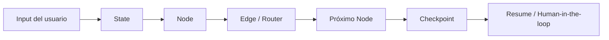
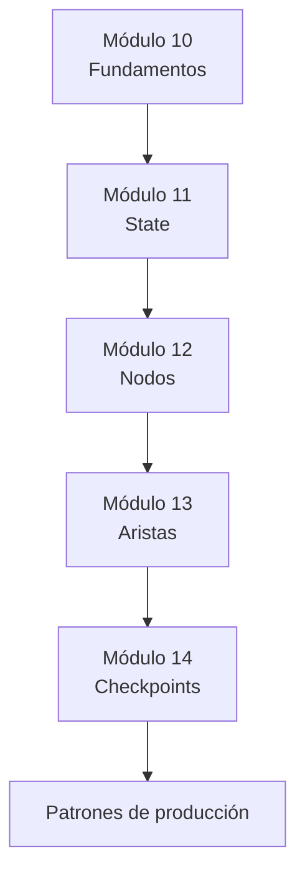

# 🧠 Módulo 10: Fundamentos de Grafos

> Índice y mapa mental de la sección de orquestación con LangGraph.

---

## 🎯 Objetivo

Entender cómo **State**, **Nodes**, **Edges** y **Checkpoints** trabajan juntos para construir agentes confiables, observables y reanudables.

---

## 🧩 Cómo encajan las piezas



### Resumen conceptual

- **State**: memoria estructurada compartida entre pasos.
- **Nodes**: funciones ejecutables que leen el state y devuelven cambios.
- **Edges**: decisiones lógicas que determinan cuál es el próximo nodo.
- **Checkpoints**: snapshots persistidos para pausar, recuperar o auditar el flujo.

Cuando estas cuatro piezas están bien diseñadas, el grafo puede:

1. Mantener contexto entre pasos.
2. Ejecutar lógica especializada por nodo.
3. Cambiar de ruta según condiciones reales.
4. Recuperarse de fallos o interrupciones humanas.

---

## 🛤️ Ruta de aprendizaje recomendada



### Orden sugerido

| Paso | Módulo | Qué aprendes | Resultado esperado |
|------|--------|--------------|--------------------|
| 1 | [`11_state`](../11_state/README.md) | Diseñar memoria tipada | State legible y acumulable |
| 2 | [`12_nodos`](../12_nodos/README.md) | Crear funciones ejecutables | Nodos simples, async y con callbacks |
| 3 | [`13_aristas`](../13_aristas/README.md) | Conectar nodos con decisiones | Routing fijo, condicional y dinámico |
| 4 | [`14_checkpoints`](../14_checkpoints/README.md) | Persistir y reanudar | Workflows tolerantes a fallos |

---

## 🔗 Índice de la sección de orquestación

### 1. State
- 📄 [`11_state/README.md`](../11_state/README.md)
- 🧪 `11_state/examples/01_basico.py`
- 🧩 `11_state/exercises/01_basico.md`

### 2. Nodos
- 📄 [`12_nodos/README.md`](../12_nodos/README.md)
- 🧪 `12_nodos/examples/01_basico.py`
- 🧩 `12_nodos/exercises/01_basico.md`

### 3. Aristas
- 📄 [`13_aristas/README.md`](../13_aristas/README.md)
- 🧪 `13_aristas/examples/01_basico.py`
- 🧩 `13_aristas/exercises/01_basico.md`

### 4. Checkpoints
- 📄 [`14_checkpoints/README.md`](../14_checkpoints/README.md)
- 🧪 `14_checkpoints/examples/01_basico.py`
- 🧩 `14_checkpoints/exercises/01_basico.md`

---

## ✅ Flujo mínimo de un agente orquestado

```python
state = load_state()
update = intake_node(state)
state = merge(state, update)
next_step = router(state)
checkpoint_store.save(thread_id="demo", state=state)
execute(next_step, state)
```

Esa secuencia resume el patrón central de LangGraph: **leer estado, ejecutar nodo, decidir ruta, persistir**.

---

## 🤖 ¿Por qué LangGraph?

LangGraph es una buena base para esta sección porque combina:

- **State tipado** con `TypedDict` y reducers.
- **Routing explícito** en lugar de cadenas ocultas.
- **Persistencia nativa** para pausar y reanudar ejecuciones.
- **Soporte para human-in-the-loop**, retries y tracing.
- **Compatibilidad con LangChain**, modelos, tools y streaming.

En otras palabras: permite construir agentes más parecidos a sistemas distribuidos confiables que a demos lineales.

---

## 🏭 Alternativas de industria

| Herramienta | Fortalezas | Cuándo elegirla |
|-------------|------------|-----------------|
| **LangGraph** | State + routing + checkpoints en un mismo modelo | Agentes complejos y workflows largos |
| **Prefect** | Orquestación robusta de data workflows | Pipelines batch y ETL |
| **Temporal** | Durabilidad extrema y replay | Procesos críticos multi-servicio |
| **Airflow** | Scheduling y DAGs clásicos | Jobs programados con fuerte enfoque en datos |
| **Haystack Pipelines** | Buen ecosistema RAG | Flujos centrados en búsqueda y documentos |
| **Custom Python orchestration** | Máxima flexibilidad | Prototipos pequeños o casos muy específicos |

---

## �� Qué debería pasar después de este bloque

Al terminar los módulos 10-14 deberías poder:

- Diseñar un **State** claro y evolutivo.
- Escribir **Nodes** reutilizables y testeables.
- Modelar **Edges** que expresen reglas de negocio reales.
- Persistir **Checkpoints** para recuperación y revisión humana.

---

## 📚 Recursos

- LangGraph Intro: <https://docs.langchain.com/docs/langgraph/intro>
- LangGraph State: <https://docs.langchain.com/docs/langgraph/working-with-state>
- LangGraph Persistence: <https://docs.langchain.com/docs/langgraph/persistence>
- TypedDict: <https://docs.python.org/3/library/typing.html#typing.TypedDict>

---

## 🔜 Próximo paso

Empieza por [`11_state`](../11_state/README.md) y avanza en orden. Cada módulo añade una pieza nueva al mismo modelo mental.
