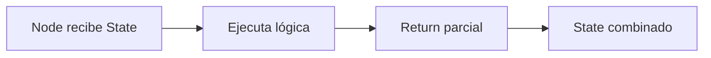

# ⚙️ Módulo 12: Nodos

> Cómo crear y configurar nodos ejecutables dentro de un grafo.

---

## 🎯 Objetivos

Al finalizar este módulo vas a poder:

- Definir nodos simples que transforman state.
- Crear nodos async con manejo de errores y retries.
- Diseñar nodos avanzados con callbacks y streaming.
- Elegir entre funciones, clases o nodos async según el caso.

---

## ❓ ¿Qué son los Nodos?

Los **Nodos** son las **funciones ejecutables del grafo**. Reciben un `State`, realizan trabajo y devuelven un cambio parcial o total del estado.



### Patrón mental: `Node → State → Return`

```python
def classify_node(state: AgentState) -> dict:
    label = "urgent" if "asap" in state["message"].lower() else "normal"
    return {"label": label}
```

Un nodo bien diseñado:

- Tiene una responsabilidad clara.
- Lee solo el state que necesita.
- Devuelve cambios mínimos y explícitos.
- Es fácil de testear de forma aislada.

---

## 🟢 Nivel 1: Básico

Usa una **función simple** cuando el trabajo sea determinístico, corto y sin dependencias externas complejas.

```python
from typing import TypedDict

class NodeState(TypedDict):
    raw_text: str
    normalized: str

def simple_processor(state: NodeState) -> dict:
    return {"normalized": state["raw_text"].strip().lower()}
```

**Úsalo cuando:**
- No hay I/O externo.
- No necesitas retries.
- El nodo es fácil de razonar en una sola función.

---

## 🟡 Nivel 2: Intermedio

Usa nodos **async** o con manejo de errores cuando llamas APIs, tools, bases de datos o servicios lentos.

```python
import asyncio
from typing import Annotated, TypedDict
import operator

class NodeState(TypedDict):
    payload: str
    retries: int
    errors: Annotated[list[str], operator.add]
    result: str

async def error_handling_node(state: NodeState) -> dict:
    try:
        await asyncio.sleep(0.05)
        if not state["payload"]:
            raise ValueError("payload vacío")
        return {"result": state["payload"].upper()}
    except Exception as exc:
        return {"retries": state["retries"] + 1, "errors": [str(exc)]}
```

**Úsalo cuando:**
- Hay latencia o dependencia externa.
- Necesitas registrar errores.
- El nodo puede recuperarse con retry o fallback.

---

## 🔴 Nivel 3: Avanzado

Usa nodos con **callbacks**, **streaming** o clases cuando el flujo de ejecución necesita observabilidad detallada o composición avanzada.

```python
from collections.abc import Callable
from typing import Annotated, TypedDict
import operator

class StreamState(TypedDict):
    text: str
    chunks: Annotated[list[str], operator.add]
    events: Annotated[list[str], operator.add]

class StreamingNode:
    def __init__(self, on_chunk: Callable[[str], None]) -> None:
        self.on_chunk = on_chunk

    def __call__(self, state: StreamState) -> dict:
        chunks = []
        for word in state["text"].split():
            self.on_chunk(word)
            chunks.append(word)
        return {"chunks": chunks, "events": [f"emitidos={len(chunks)}"]}
```

**Úsalo cuando:**
- El nodo expone hooks para UI, tracing o métricas.
- Quieres encapsular dependencias en una clase.
- El resultado llega por partes en lugar de un único bloque.

---

## 🧠 ¿Cuándo usar nodos simples vs complejos?

| Escenario | Recomendación |
|-----------|---------------|
| Normalización de texto, parseo, mapping | Función simple |
| Llamadas HTTP, queries, herramientas | Nodo async |
| Streaming, callbacks, dependencias inyectadas | Clase o async avanzado |
| Lógica compartida por varios grafos | Clase o factory function |
| Workflows auditables en producción | Clase + callbacks + telemetry |

---

## 🔄 Alternativas de implementación

| Opción | Ventajas | Desventajas | Mejor uso |
|--------|----------|-------------|-----------|
| **Funciones** | Simples, legibles, fáciles de testear | Menos encapsulación | Nodos puros y pequeños |
| **Clases** | Inyección de dependencias, estado interno, hooks | Más boilerplate | SDKs, tracing, adapters |
| **Async functions** | Concurrencia e I/O eficiente | Complejidad extra | APIs, tools, streaming |

---

## 🧰 Herramientas y frameworks relacionados

| Herramienta | Qué aporta a nodos | Trade-off |
|-------------|--------------------|-----------|
| **LangGraph** | Contrato claro de state + nodos + edges | Requiere modelar estado explícitamente |
| **LangChain LCEL** | Composición rápida de cadenas | Menos explícito para rutas complejas |
| **Prefect** | Task runners y observabilidad | Menos centrado en agentes conversacionales |
| **Temporal** | Durabilidad extrema | Curva operativa mayor |
| **Async Python puro** | Control total | Más trabajo manual |

---

## 🚀 Quick Start en 4 pasos

1. Define un `TypedDict` para tu state.
2. Implementa un nodo que reciba `state` y retorne un `dict`.
3. Decide si el nodo debe ser simple, async o clase.
4. Prueba el nodo de forma aislada antes de conectarlo al grafo.

```python
state = {"raw_text": "  Hola Mundo  ", "normalized": ""}
update = simple_processor(state)
state.update(update)
print(state["normalized"])
```

---

## 🧪 Ejemplos prácticos

### 1. `SimpleProcessor`
- Archivo: `examples/01_basico.py`
- Caso real: limpiar entradas antes de clasificación o extracción.

### 2. `ErrorHandlingNode`
- Archivo: `examples/02_intermedio.py`
- Caso real: llamar una API o tool con manejo de errores y retries.

### 3. `StreamingNode`
- Archivo: `examples/03_avanzado.py`
- Caso real: enviar tokens parciales a UI, logs o métricas.

---

## ✍️ Ejercicios

| Nivel | Desafío | Referencia de solución |
|------|---------|------------------------|
| Básico | Crear un nodo que normalice tickets | `solutions/01_basico.py` |
| Intermedio | Implementar retry + errores acumulados | `solutions/02_intermedio.py` |
| Avanzado | Emitir eventos por callbacks y streaming | `solutions/03_avanzado.py` |

---

## 📚 Recursos

- LangGraph Nodes: <https://docs.langchain.com/docs/langgraph/quickstart>
- AsyncIO: <https://docs.python.org/3/library/asyncio.html>
- TypedDict: <https://docs.python.org/3/library/typing.html#typing.TypedDict>

---

## 🔜 Próximos pasos

1. Ejecuta `examples/01_basico.py`.
2. Resuelve `exercises/02_intermedio.md`.
3. Avanza a [`13_aristas`](../13_aristas/README.md) para conectar nodos con decisiones.
