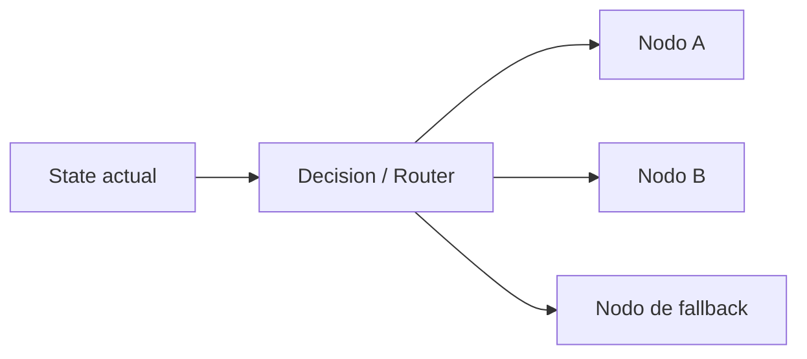

# 🔀 Módulo 13: Aristas

> Cómo modelar routing, decisiones y transiciones entre nodos.

---

## 🎯 Objetivos

Al terminar este módulo vas a poder:

- Conectar nodos con aristas fijas.
- Crear routing condicional basado en state.
- Diseñar rutas dinámicas, paralelas y con fallback.
- Comparar cómo resuelve LangGraph este problema frente a otras herramientas.

---

## ❓ ¿Qué son las Aristas?

Las **Aristas** son las **decisiones lógicas que conectan nodos**. Definen hacia dónde continúa el flujo después de cada paso.



Sin aristas, un grafo sería solo una colección de funciones. Con aristas, el sistema puede adaptarse al contexto.

---

## 🟢 Nivel 1: Básico — Aristas fijas

Cuando el flujo siempre sigue el mismo orden, basta una arista recta entre nodos.

```python
pipeline = ["collect", "summarize", "store"]
for step in pipeline:
    state = run_node(step, state)
```

**Úsalo cuando:**
- Hay una secuencia lineal conocida.
- No existen bifurcaciones.
- Estás prototipando el proceso.

---

## 🟡 Nivel 2: Intermedio — Routing condicional

Aquí una función router inspecciona el state y decide el próximo nodo.

```python
from typing import Literal, TypedDict

class RouteState(TypedDict):
    is_valid: bool
    next_node: str

def validation_router(state: RouteState) -> Literal["process", "reject"]:
    return "process" if state["is_valid"] else "reject"
```

**Patrones típicos:**
- if/else routing
- clasificación por score
- errores que van a fallback

---

## 🔴 Nivel 3: Avanzado — Routing dinámico y paralelo

Las aristas avanzadas pueden:

- Elegir un subconjunto variable de nodos.
- Lanzar trabajo en paralelo.
- Reintentar o redirigir a fallbacks.

```python
def dynamic_router(state: RouteState) -> list[str]:
    targets = ["primary"]
    if state.get("needs_audit"):
        targets.append("audit")
    if state.get("high_load"):
        targets.append("overflow_worker")
    return targets
```

Este patrón es muy útil cuando el grafo actúa como sistema operativo de agentes y no solo como pipeline lineal.

---

## 🧭 Tipos de aristas

| Tipo | Qué hace | Ejemplo |
|------|----------|---------|
| **Straight** | Siempre conecta al mismo nodo | `collect -> summarize` |
| **Conditional** | Elige entre rutas conocidas | `valid ? approve : reject` |
| **Dynamic** | Construye rutas en tiempo de ejecución | `send_to_available_workers(state)` |

---

## 🧱 Patrones comunes

### 1. If / Else routing
Ideal para validaciones, moderación o clasificación.

### 2. Multi-path routing
Útil cuando una entrada debe procesarse por varias ramas: análisis, auditoría, cache, etc.

### 3. Fallback handlers
Muy valioso cuando un nodo principal falla y existe una ruta de degradación segura.

---

## 🚀 Quick Start con router functions

1. Define qué campos del state gobiernan la decisión.
2. Implementa una función `router(state)` que retorne el próximo nodo.
3. Documenta todas las rutas posibles.
4. Prueba casos felices, inválidos y de error.

```python
def router(state: dict) -> str:
    if state["error_count"] > 0:
        return "fallback"
    return "continue"
```

---

## 🧪 Ejemplos prácticos

### 1. `ValidationRouter`
- Archivo: `examples/02_intermedio.py`
- Decide si una solicitud avanza o vuelve con feedback.

### 2. `LoadBalancer`
- Archivo: `examples/03_avanzado.py`
- Distribuye trabajo al worker menos cargado o a varios workers.

### 3. `FallbackEdge`
- Archivo: `examples/03_avanzado.py`
- Redirige a un camino seguro cuando falla la ruta principal.

---

## 🧰 LangGraph vs otras herramientas

| Herramienta | Modelo de routing | Cuándo destaca |
|-------------|-------------------|----------------|
| **LangGraph** | Routing explícito por state y edges | Agentes con decisiones complejas |
| **Temporal** | Workflows durables con branching fuerte | Procesos críticos multi-servicio |
| **Prefect** | Tasks y branching orientado a pipelines | Data / ETL / jobs de negocio |
| **Airflow** | DAGs programados | Orquestación batch calendarizada |
| **Python puro** | Control manual total | Prototipos o motores mínimos |

---

## ✍️ Ejercicios

| Nivel | Desafío | Referencia |
|------|---------|------------|
| Básico | Pipeline fijo de 3 nodos | `solutions/01_basico.py` |
| Intermedio | Router por validación y score | `solutions/02_intermedio.py` |
| Avanzado | Routing dinámico con fallback y paralelo | `solutions/03_avanzado.py` |

---

## 📚 Recursos

- LangGraph Conditional Edges: <https://docs.langchain.com/docs/langgraph/quickstart>
- Python `concurrent.futures`: <https://docs.python.org/3/library/concurrent.futures.html>
- TypedDict & Literal: <https://docs.python.org/3/library/typing.html>

---

## 🔜 Próximos pasos

1. Ejecuta `examples/01_basico.py` para fijar el modelo mental.
2. Practica routing con `exercises/02_intermedio.md`.
3. Continúa con [`14_checkpoints`](../14_checkpoints/README.md) para hacer persistente el flujo.
