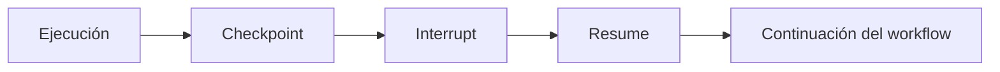

# 💾 Módulo 14: Checkpoints

> Persistencia y reanudación de workflows interrumpidos.

---

## 🎯 Objetivos

Al finalizar este módulo vas a poder:

- Entender por qué los checkpoints son claves en agentes reales.
- Guardar snapshots simples en archivo.
- Persistir estado en base de datos para recuperación.
- Modelar checkpointing avanzado con tracing distribuido.

---

## ❓ ¿Qué son los Checkpoints?

Los **Checkpoints** son **snapshots persistidos** del estado de ejecución. Permiten resumir un agente o workflow después de una interrupción, un fallo o una aprobación humana.



---

## 🤝 ¿Por qué importan?

Los checkpoints son importantes porque habilitan:

- **Fault tolerance**: si un worker cae, el proceso no vuelve a cero.
- **Long-running workflows**: ideal para tareas que duran minutos, horas o días.
- **Human intervention**: un aprobador puede pausar y retomar sin perder contexto.
- **Auditoría**: queda registro de qué cambió y cuándo.

---

## 🟢 Nivel 1: Básico — almacenamiento en archivo

```python
import json
from pathlib import Path
from typing import TypedDict

class CheckpointState(TypedDict):
    step: str
    processed: int

file_path = Path("checkpoint.json")
file_path.write_text(json.dumps({"step": "collect", "processed": 10}))
restored = json.loads(file_path.read_text())
```

**Úsalo cuando:**
- Estás aprendiendo el patrón.
- El flujo vive en una sola máquina.
- El volumen de checkpoints es pequeño.

---

## 🟡 Nivel 2: Intermedio — base de datos

```python
import json
import sqlite3

conn = sqlite3.connect("checkpoints.db")
conn.execute(
    "CREATE TABLE IF NOT EXISTS checkpoints (thread_id TEXT, payload TEXT)"
)
conn.execute(
    "INSERT INTO checkpoints VALUES (?, ?)",
    ("thread-1", json.dumps({"step": "awaiting_approval"})),
)
conn.commit()
```

**Úsalo cuando:**
- Hay múltiples ejecuciones concurrentes.
- Necesitas consultas, filtros o auditoría.
- Un archivo ya no es suficiente.

---

## 🔴 Nivel 3: Avanzado — tracing distribuido

```python
from typing import Annotated, TypedDict
import operator

class TraceState(TypedDict):
    trace_id: str
    spans: Annotated[list[str], operator.add]
    checkpoint_version: int

def distributed_checkpoint(state: TraceState) -> dict:
    return {
        "spans": [f"checkpoint:v{state['checkpoint_version'] + 1}"],
        "checkpoint_version": state["checkpoint_version"] + 1,
    }
```

**Úsalo cuando:**
- El workflow cruza procesos o servicios.
- Quieres correlacionar checkpoints con métricas y logs.
- Necesitas reanudar desde distintos workers.

---

## 🗃️ Opciones de storage

| Opción | Ventajas | Limitaciones | Buen uso |
|--------|----------|--------------|----------|
| **Memory** | Muy rápido | Se pierde al reiniciar | Tests, prototipos |
| **File** | Simple, legible | Poca concurrencia | Demos locales |
| **Database** | Consultable, durable | Requiere esquema y operaciones | Producción básica |
| **S3 / Object storage** | Escalable y compartido | Más latencia y versionado | Flujos distribuidos |

---

## 🧰 Alternativas de industria

| Herramienta | Enfoque de persistencia | Cuándo elegirla |
|-------------|------------------------|-----------------|
| **LangGraph** | Checkpoints integrados al grafo | Agentes con pausas y resume |
| **Temporal** | Event history duradera | Procesos críticos con replay |
| **Prefect** | State store y observabilidad | Pipelines operativos |
| **Celery + backend** | Persistencia de tareas | Workers distribuidos clásicos |
| **Python puro** | Máximo control | Aprendizaje o tooling interno |

---

## 🚀 Quick Start

1. Define el `State` mínimo que debe sobrevivir a una interrupción.
2. Elige un backend de persistencia.
3. Guarda un snapshot al final de cada etapa importante.
4. Implementa una función de `resume(thread_id)` y pruébala.

---

## 🧪 Ejemplos prácticos

### 1. `FileCheckpoint`
- Archivo: `examples/01_basico.py`
- Guarda y restaura un workflow desde JSON.

### 2. `DBCheckpoint`
- Archivo: `examples/02_intermedio.py`
- Usa SQLite para versionar checkpoints por `thread_id`.

### 3. `DistributedCheckpoint`
- Archivo: `examples/03_avanzado.py`
- Añade tracing, ownership por worker y reanudación segura.

---

## ✍️ Ejercicios

| Nivel | Desafío | Solución |
|------|---------|----------|
| Básico | Guardar y restaurar un state de revisión | `solutions/01_basico.py` |
| Intermedio | Versionar checkpoints en SQLite | `solutions/02_intermedio.py` |
| Avanzado | Agregar trazas y resume distribuido | `solutions/03_avanzado.py` |

---

## 📚 Recursos

- LangGraph Persistence: <https://docs.langchain.com/docs/langgraph/persistence>
- SQLite Python: <https://docs.python.org/3/library/sqlite3.html>
- JSON module: <https://docs.python.org/3/library/json.html>

---

## 🔜 Próximos pasos

1. Ejecuta `examples/01_basico.py` y revisa el archivo generado.
2. Completa `exercises/02_intermedio.md`.
3. Integra checkpoints con nodos y aristas en un mini grafo end-to-end.
